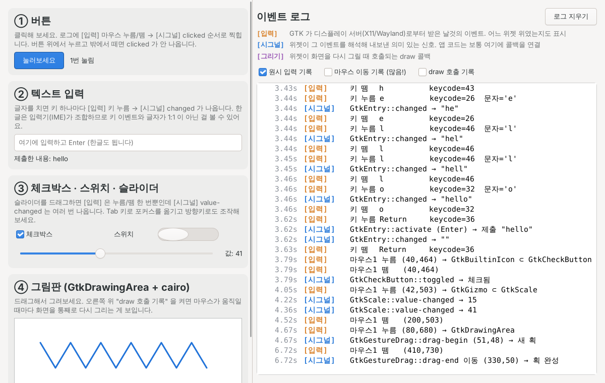

# 리눅스 네이티브 GUI 실험실

같은 GUI(버튼 · 텍스트 입력 · 그림판)를 두 가지 방식으로 만들어 비교합니다.

| | `gtk-lab` (GTK4) | `xlib-hello` (툴킷 없음) |
|---|---|---|
| 소스 | `gtk/main.c` | `xlib/main.c` |
| 위젯 | GTK 가 제공 | 사각형 그리기 + 좌표 판정으로 직접 구현 |
| 한글 | 입력 · 표시 모두 됨 | 안 됨 (입력기 · 폰트 렌더링이 없음) |
| 보는 것 | 원시 입력 → 위젯 시그널 흐름 | 디스플레이 서버와 직접 주고받는 날것 그대로 |

## gtk-lab — GTK 이벤트 실험실



왼쪽 위젯을 조작하면 오른쪽 로그에 **세 종류의 이벤트**가 색깔별로 찍힙니다.

- <b>[입력]</b> (주황) — GTK 가 디스플레이 서버에서 받은 원시 이벤트. 마우스를 누른 자리에 **어떤 위젯이 있었는지**도 표시합니다 (`GtkLabel ⊂ GtkButton` = 버튼 안의 라벨을 눌렀음).
- <b>[시그널]</b> (파랑) — 위젯이 그 이벤트를 해석해 내보낸 고수준 신호. 앱 코드는 보통 여기에 콜백을 연결합니다.
- <b>[그리기]</b> (보라) — 위젯이 다시 그려질 때 호출되는 draw 콜백 (기본은 꺼짐, 체크해서 켜기).

해보면 재미있는 것:

- 버튼 위에서 누르고 **밖으로 끌고 나가서 떼면** `clicked` 가 안 나옵니다.
- 버튼에 포커스가 있을 때 **Enter/Space** 를 누르면 마우스 없이도 `clicked` 가 나옵니다 — 시그널은 "어떻게 눌렸는지"와 무관한 *의미*입니다.
- 슬라이더를 드래그하면 [입력] 누름/뗌은 한 번인데 `value-changed` 는 여러 번 나옵니다.
- 입력창에 한글을 치면 키 이벤트 수와 글자 수가 맞지 않습니다 — 입력기(IME)가 중간에서 조합하기 때문입니다.
- "draw 호출 기록"을 켜고 그림판에 그리면, 점 하나 추가할 때마다 **전체를 다시 그리는** 게 보입니다.

## 빌드 & 실행

```bash
# Debian/Ubuntu (22.04 이상)
sudo apt install build-essential pkg-config libgtk-4-dev libx11-dev
# Fedora:  sudo dnf install gcc make pkgconf gtk4-devel libX11-devel

make            # gtk-lab 빌드
./gtk-lab

make xlib-hello # 툴킷 없는 버전
./xlib-hello -v
```

Windows 라면 WSL2(Ubuntu)에서 위 명령을 그대로 실행하면 창이 Windows 화면에 뜹니다.
창이 까맣게 나오면 `GSK_RENDERER=cairo ./gtk-lab` 으로 실행해 보세요 (GPU 가속 없이 그림).

## xlib-hello — 툴킷 없이 직접


GTK·Qt 같은 툴킷 **없이** X11 프로토콜(Xlib)만으로 버튼·입력창·그림판을 구현했습니다.
`Esc` 또는 창 닫기로 종료합니다.

## 리눅스 GUI 스택 한눈에 보기

```
 ┌─────────────────────────────┐
 │ 앱 (이 프로그램, Firefox ...) │  상태 관리 + "무엇을 그릴지" 결정
 ├─────────────────────────────┤
 │ 툴킷 (GTK, Qt, ...)          │  위젯·레이아웃·테마·접근성  ← 이 앱은 이 층을 생략하고 직접 구현
 ├─────────────────────────────┤
 │ Xlib / libxcb / libwayland  │  프로토콜 메시지를 만들어 소켓으로 전송
 └──────────────┬──────────────┘
                │  유닉스 소켓 (/tmp/.X11-unix/X0  또는  $XDG_RUNTIME_DIR/wayland-0)
 ┌──────────────▼──────────────┐
 │ 디스플레이 서버               │  X 서버(Xorg) 또는 Wayland 컴포지터(Mutter, KWin ...)
 │ + 윈도우 매니저/컴포지터       │  창 배치, 테두리, 포커스, 화면 합성
 ├─────────────────────────────┤
 │ 커널: evdev(입력) / DRM·KMS(출력) │  키보드·마우스 → 이벤트, 프레임버퍼 → 모니터
 └─────────────────────────────┘
```

핵심은 **앱과 디스플레이 서버가 별개의 프로세스이고, 소켓으로 메시지를 주고받는다**는 점입니다.
앱은 "이 창에 사각형을 그려줘" 같은 *요청*을 보내고, 서버는 "마우스 버튼이 (60,30)에서 눌렸어" 같은 *이벤트*를 돌려줍니다.

## 코드에서 볼 수 있는 것

| 개념 | xlib-hello 코드 | GTK 에서는 (gtk-lab 코드) |
|---|---|---|
| 서버 접속 | `XOpenDisplay` (`$DISPLAY` 사용) | `gtk_init()` 안에 숨어 있음 |
| 창 생성/표시 | `XCreateSimpleWindow`, `XMapWindow` | `gtk_window_new()` |
| 이벤트 구독 | `XSelectInput` — 등록 안 한 이벤트는 아예 안 옴 | `GtkEventController` 를 위젯에 붙임 |
| **이벤트 루프** | `for (;;) { XNextEvent(); handle_event(); }` | `g_application_run()` 안에 숨어 있음 |
| 위젯 = 사각형 | `Rect`, `rect_hit()` 히트 테스트 | `gtk_widget_pick()` 이 대신 해줌 |
| 클릭 판정 | Press 와 Release 가 모두 버튼 안일 때만 `on_click` | `"clicked"` 시그널 |
| 키보드 포커스 | `focus_input` 플래그, 포커스 없으면 키 무시 | 포커스 체인 |
| 키 변환 | keycode → KeySym → 문자 (`XLookupString`) | 입력기(IME)까지 처리 |
| 다시 그리기 | `Expose` 이벤트 → `redraw()` | `gtk_drawing_area_set_draw_func()` |
| 깜빡임 방지 | `Pixmap` 백버퍼에 그린 뒤 `XCopyArea` | 자동 더블 버퍼링 |
| 레이아웃 | `ConfigureNotify` → `layout()` 재계산 | `GtkBox`, `QLayout` |
| 창 닫기 | `WM_DELETE_WINDOW` `ClientMessage` (ICCCM) | `"close-request"` |
| 요청 버퍼링 | `XFlush` — Xlib 은 요청을 모았다가 보냄 | 프레임마다 자동 |

### 알아두면 재미있는 점

- **X 서버는 창 내용을 기억하지 않습니다.** 다른 창이 가렸다가 비켜나면 `Expose` 이벤트가 오고, 앱이 다시 그려야 합니다. (요즘 컴포지터는 버퍼를 보관하긴 하지만, 프로토콜상 책임은 여전히 앱에 있습니다.)
- **"버튼"은 서버가 모르는 개념입니다.** 서버가 아는 건 창, 픽셀, 입력 이벤트뿐이고, 버튼·스크롤바·메뉴는 전부 클라이언트(툴킷)가 그린 그림입니다.
- **앱은 대부분의 시간을 잠들어 있습니다.** `XNextEvent` 가 이벤트가 올 때까지 블록하기 때문에 CPU 를 거의 쓰지 않습니다.
- xlib-hello 에서 한글 입력이 안 되는 것도 의도된 한계입니다. 한글은 입력기(IBus/fcitx, XIM)와 폰트 렌더링(Xft/FreeType/HarfBuzz)이 필요한데, 그게 바로 툴킷이 대신 해주는 일입니다.

## 다음 단계로 해볼 만한 것

1. `xev` 를 실행해서 실제 데스크톱이 보내는 이벤트 흐름 관찰하기
2. `gtk/main.c` 와 `xlib/main.c` 를 나란히 놓고 같은 기능이 어떻게 다른지 비교하기
3. Xlib 대신 `libxcb` 로 포팅해보기 (비동기 요청/응답 구조가 더 잘 드러남)
4. Wayland 네이티브 클라이언트(`wl_compositor`, `xdg_shell`, 공유 메모리 버퍼)로 다시 만들어보기 — X11 과 달리 "그리기 요청"이 없고 앱이 픽셀 버퍼를 통째로 넘깁니다
