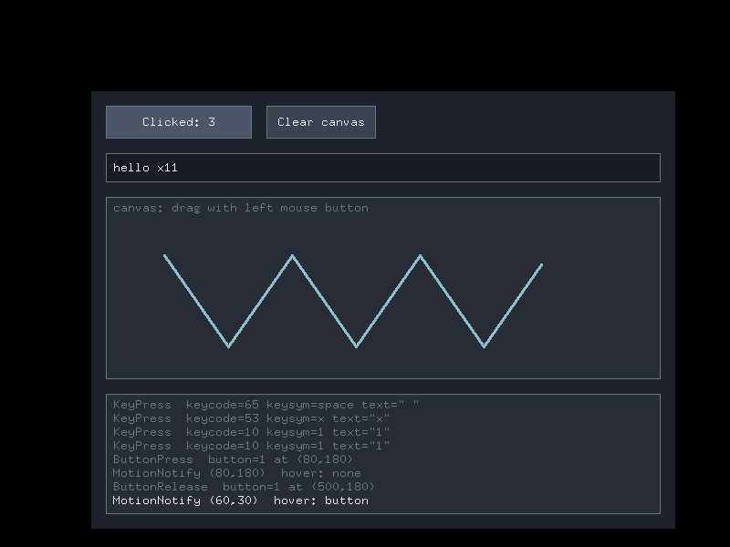

# xlib-hello — 툴킷 없이 만든 리눅스 네이티브 GUI 테스트 앱

GTK·Qt 같은 툴킷을 **쓰지 않고**, X11 프로토콜(Xlib)만으로 버튼·텍스트 입력창·그림판을 직접 구현한 작은 앱입니다.
"네이티브 GUI가 실제로 어떻게 돌아가는가"를 코드 한 파일(`src/main.c`, 약 400줄)로 볼 수 있게 만들었습니다.



## 빌드 & 실행

```bash
# Debian/Ubuntu
sudo apt install build-essential libx11-dev pkg-config
# Fedora:  sudo dnf install gcc make libX11-devel pkgconf

make
./xlib-hello -v     # -v : 받은 이벤트를 터미널에도 출력
```

Wayland 데스크톱(최신 GNOME/KDE)에서도 XWayland 덕분에 그대로 실행됩니다.
화면이 없는 서버라면 `Xvfb :99 & DISPLAY=:99 ./xlib-hello` 로 가상 디스플레이에서 돌릴 수 있습니다.

조작: 버튼 클릭 → 카운터 증가 / 입력창 클릭 후 타이핑, Enter 로 제출 / 그림판에서 드래그 / `Esc` 또는 창 닫기로 종료.
화면 아래 로그 패널에 X 서버로부터 받은 이벤트가 실시간으로 표시됩니다.

## 리눅스 GUI 스택 한눈에 보기

```
 ┌─────────────────────────────┐
 │ 앱 (이 프로그램, Firefox ...) │  상태 관리 + "무엇을 그릴지" 결정
 ├─────────────────────────────┤
 │ 툴킷 (GTK, Qt, ...)          │  위젯·레이아웃·테마·접근성  ← 이 앱은 이 층을 생략하고 직접 구현
 ├─────────────────────────────┤
 │ Xlib / libxcb / libwayland  │  프로토콜 메시지를 만들어 소켓으로 전송
 └──────────────┬──────────────┘
                │  유닉스 소켓 (/tmp/.X11-unix/X0  또는  $XDG_RUNTIME_DIR/wayland-0)
 ┌──────────────▼──────────────┐
 │ 디스플레이 서버               │  X 서버(Xorg) 또는 Wayland 컴포지터(Mutter, KWin ...)
 │ + 윈도우 매니저/컴포지터       │  창 배치, 테두리, 포커스, 화면 합성
 ├─────────────────────────────┤
 │ 커널: evdev(입력) / DRM·KMS(출력) │  키보드·마우스 → 이벤트, 프레임버퍼 → 모니터
 └─────────────────────────────┘
```

핵심은 **앱과 디스플레이 서버가 별개의 프로세스이고, 소켓으로 메시지를 주고받는다**는 점입니다.
앱은 "이 창에 사각형을 그려줘" 같은 *요청*을 보내고, 서버는 "마우스 버튼이 (60,30)에서 눌렸어" 같은 *이벤트*를 돌려줍니다.

## 코드에서 볼 수 있는 것

| 개념 | 코드 위치 | 툴킷에서는 |
|---|---|---|
| 서버 접속 | `XOpenDisplay` (`$DISPLAY` 사용) | `gtk_init()` 안에 숨어 있음 |
| 창 생성/표시 | `XCreateSimpleWindow`, `XMapWindow` | `gtk_window_new()` |
| 이벤트 구독 | `XSelectInput` — 등록 안 한 이벤트는 아예 안 옴 | 툴킷이 알아서 |
| **이벤트 루프** | `for (;;) { XNextEvent(); handle_event(); }` | `gtk_main()`, `app.exec()` |
| 위젯 = 사각형 | `Rect`, `rect_hit()` 히트 테스트 | `GtkButton` 객체 |
| 클릭 판정 | Press 와 Release 가 모두 버튼 안일 때만 `on_click` | `"clicked"` 시그널 |
| 키보드 포커스 | `focus_input` 플래그, 포커스 없으면 키 무시 | 포커스 체인 |
| 키 변환 | keycode → KeySym → 문자 (`XLookupString`) | 입력기(IME)까지 처리 |
| 다시 그리기 | `Expose` 이벤트 → `redraw()` | `draw` 시그널 |
| 깜빡임 방지 | `Pixmap` 백버퍼에 그린 뒤 `XCopyArea` | 자동 더블 버퍼링 |
| 레이아웃 | `ConfigureNotify` → `layout()` 재계산 | `GtkBox`, `QLayout` |
| 창 닫기 | `WM_DELETE_WINDOW` `ClientMessage` (ICCCM) | `"close-request"` |
| 요청 버퍼링 | `XFlush` — Xlib 은 요청을 모았다가 보냄 | 프레임마다 자동 |

### 알아두면 재미있는 점

- **X 서버는 창 내용을 기억하지 않습니다.** 다른 창이 가렸다가 비켜나면 `Expose` 이벤트가 오고, 앱이 다시 그려야 합니다. (요즘 컴포지터는 버퍼를 보관하긴 하지만, 프로토콜상 책임은 여전히 앱에 있습니다.)
- **"버튼"은 서버가 모르는 개념입니다.** 서버가 아는 건 창, 픽셀, 입력 이벤트뿐이고, 버튼·스크롤바·메뉴는 전부 클라이언트(툴킷)가 그린 그림입니다.
- **앱은 대부분의 시간을 잠들어 있습니다.** `XNextEvent` 가 이벤트가 올 때까지 블록하기 때문에 CPU 를 거의 쓰지 않습니다.
- 이 앱에서 한글 입력이 안 되는 것도 의도된 한계입니다. 한글은 입력기(IBus/fcitx, XIM)와 폰트 렌더링(Xft/FreeType/HarfBuzz)이 필요한데, 그게 바로 툴킷이 대신 해주는 일입니다.

## 다음 단계로 해볼 만한 것

1. `xev` 를 실행해서 실제 데스크톱이 보내는 이벤트 흐름 관찰하기
2. 같은 UI 를 GTK4(`gtk_button_new_with_label`) 로 만들어 코드 양 비교하기
3. Xlib 대신 `libxcb` 로 포팅해보기 (비동기 요청/응답 구조가 더 잘 드러남)
4. Wayland 네이티브 클라이언트(`wl_compositor`, `xdg_shell`, 공유 메모리 버퍼)로 다시 만들어보기 — X11 과 달리 "그리기 요청"이 없고 앱이 픽셀 버퍼를 통째로 넘깁니다
